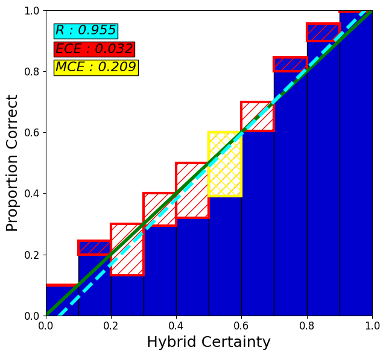
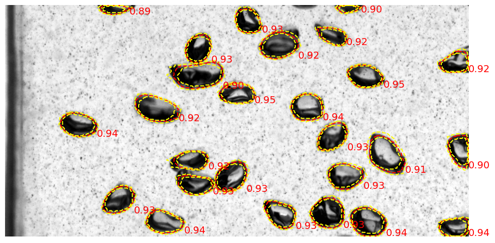

# Installation
```
git clone <Repo>
```
```
pip install -r requirements.txt
```
```
python setup.py install
```

# Usage
Modify the *config.yaml* file as per the comment in the file.

## Train Pipeline
Once modified the *config.yaml* file, run the piepeline by:

`python pipeline config.yaml --all` to run the entire pipeline.

`python pipeline config.yaml --splitting` to just run data slitting (the decription of the data folder location has been metioned in *config.yaml*)

`python pipeline config.yaml --training` to just run model training

`python pipeline config.yaml --infering` to just run inference on the model (if the model is train not using this pipeline then, the decription of the model folder location has been metioned in *config.yaml*)

`python pipeline config.yaml --clustering` to just run clustring on the predicted instances (only useable if the inference is done by this pipeline)

`python pipeline config.yaml --calibrating` to just run calibration on the predicted instances (only useable if the inference nad clustering are done by this pipeline)

## Calibration Plot

`python calibration_plot config.yaml` to plot the calibration of the uncertainty


## Uncertainty Visualization

`python uncertainty_visualization config.yaml` to visualize the spatial uncertainty
